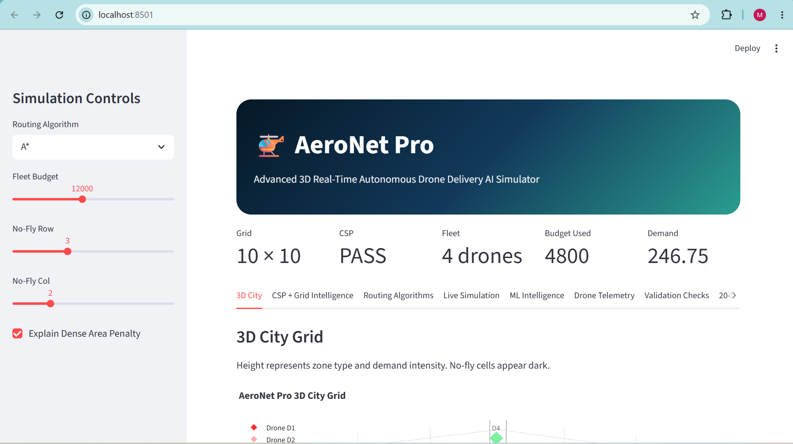
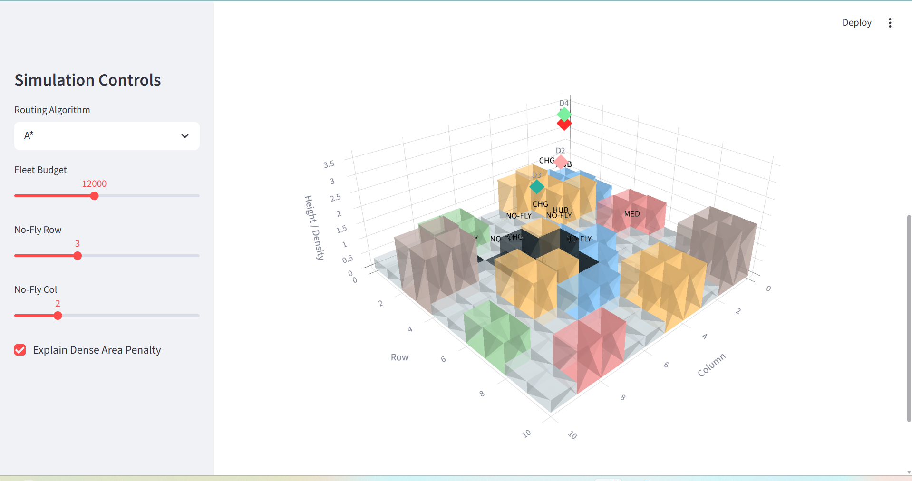
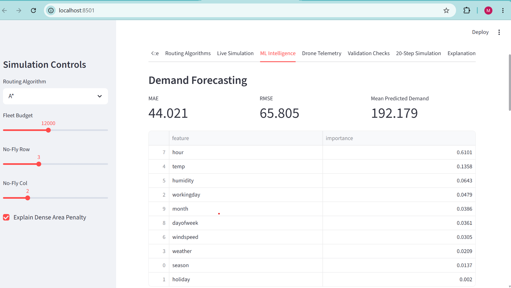

# AeroNet Pro: Autonomous Drone Delivery AI Simulator

## Overview

AeroNet Pro is an AI-powered autonomous drone delivery simulation system built on a 10×10 smart-city grid. The project integrates multiple Artificial Intelligence techniques into a single delivery pipeline, including constraint satisfaction, route optimization, dynamic replanning, demand forecasting, anomaly detection, and interactive visualization.

The system simulates how a fleet of autonomous drones can safely deliver packages while adapting to changing city conditions such as no-fly zones and delivery demand fluctuations.

## Key Features

* Smart-city 10×10 grid simulation
* Constraint Satisfaction Problem (CSP) based layout validation
* Budget-aware drone fleet selection
* A*, Dijkstra, and Weighted A* route planning
* Dynamic no-fly zone avoidance and rerouting
* Machine Learning-based demand forecasting
* Drone anomaly detection using classification models
* Interactive Streamlit dashboard
* 3D route visualization using Plotly
* Standalone HTML animation export
* CSV and TXT report generation

## AI Techniques Used

| Module             | Technique                                    |
| ------------------ | -------------------------------------------- |
| Layout Validation  | Constraint Satisfaction Problem (CSP)        |
| Fleet Selection    | Heuristic Optimization                       |
| Route Planning     | A*, Dijkstra, Weighted A*                    |
| Dynamic Rerouting  | Real-Time Replanning                         |
| Demand Forecasting | Random Forest Regression                     |
| Anomaly Detection  | Decision Tree / Random Forest Classification |

## Technologies

* Python
* Streamlit
* Plotly
* Pandas
* NumPy
* Scikit-learn
* Matplotlib
* Jupyter Notebook

## Results

| Component                  | Result                         |
| -------------------------- | ------------------------------ |
| Grid Validation            | PASS                           |
| Fleet Selected             | 3 Light Drones + 1 Heavy Drone |
| Budget Used                | 4800                           |
| Demand Forecasting MAE     | 44.021                         |
| Demand Forecasting RMSE    | 65.805                         |
| Anomaly Detection Accuracy | 98.6%                          |
| Validation Checks          | 10/10 Passed                   |

## Running the Project

```bash
pip install -r requirements.txt
streamlit run app.py
```

## Project Structure

```text
aeronet_pro/
├── app.py
├── routing.py
├── simulation.py
├── ml_models.py
├── visual3d.py
├── data/
├── notebooks/
├── outputs/
└── report/
```
## Skills Demonstrated

- Artificial Intelligence
- Machine Learning
- Pathfinding Algorithms
- Constraint Satisfaction Problems
- Data Visualization
- Simulation Design
- Python Development
- Streamlit
- Software Architecture

## Future Improvements

- Reinforcement Learning for route optimization
- Multi-city simulation
- Real-time weather integration
- Live drone telemetry streams
- Cloud deployment

## Academic Information

Course: Artificial Intelligence

Institution: FAST-NUCES

Year: 2026

## Screenshots

### Dashboard

[

### 3D Route Visualization

[

### Demand Forecasting Results

[

## Demo Video
[

Watch the project demonstration here:
[🎥 AeroNet Pro Demo](https://youtu.be/kYiO-W4vSy4)

The demo showcases:
- Grid validation using CSP
- Fleet selection under budget constraints
- A* and Dijkstra route planning
- Dynamic no-fly zone rerouting
- Demand forecasting
- Drone anomaly detection
- Interactive 3D visualization

## Author

Maimoona Hanan and Team

FAST National University of Computer and Emerging Sciences (FAST-NUCES)

Data Science & Artificial Intelligence Project
